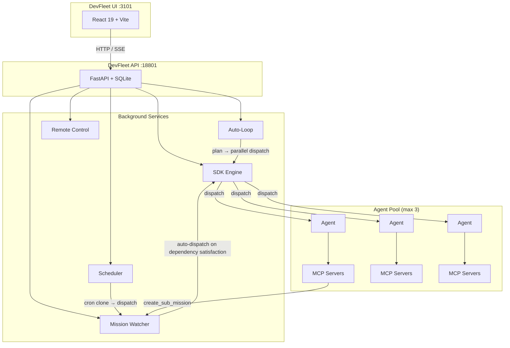

# DevFleet — Autonomous Coding Agent Platform

[](LICENSE)

Multi-agent coding platform that dispatches [Claude Code](https://docs.anthropic.com/en/docs/claude-code) agents to work on missions (coding tasks). Agents run in isolated git worktrees with MCP-powered tools, create sub-missions for other agents, and coordinate autonomously through a dependency-aware dispatch system.

Built on the Claude Code SDK and MCP (Model Context Protocol) ecosystem.

## Architecture

```
frontend/          React 19 + Vite UI (port 3101 via nginx)
backend/           FastAPI + SQLite (port 18801, uvicorn --reload)
```

Runs in Docker via `docker-compose.yml` or locally with a Python venv.



### Architecture Evolution

See the full [architecture evolution diagram](diagrams/devfleet-architecture-evolution.html) showing the platform's progression from CLI subprocess spawning (Phase 0) through SDK migration (Phase 1), MCP ecosystem (Phase 2), to autonomous multi-agent orchestration (Phase 3).

### Dual Engine

DevFleet supports two dispatch engines, selectable via `DEVFLEET_ENGINE`:

| Engine | Mode | How it works |
|--------|------|--------------|
| `sdk` (default) | Claude Code SDK | Uses `claude-code-sdk` Python API with native async streaming, MCP server attachment, structured message types |
| `cli` | CLI subprocess | Spawns `claude` CLI with `--output-format stream-json`, parses stdout events |

## Quick Start

### Prerequisites

- Python 3.11+ (for backend)
- Node.js 18+ (for frontend)
- [Claude CLI](https://docs.anthropic.com/en/docs/claude-code) installed
- Anthropic API key configured in Claude CLI

### Option A: Local development (recommended)

```bash
git clone https://github.com/LEC-AI/DevFleet.git
cd devfleet

# Backend
python3 -m venv venv
source venv/bin/activate
pip install -r backend/requirements.txt

# Start API server
cd backend
uvicorn app:app --host 0.0.0.0 --port 18801 --reload

# Frontend (separate terminal)
cd frontend
npm install && npm run dev
# UI: http://localhost:3100
# API: http://localhost:18801/docs
```

### Option B: Docker

```bash
git clone https://github.com/LEC-AI/DevFleet.git
cd devfleet
```

Add your project repos to `docker-compose.yml`:

```yaml
volumes:
  - /path/to/your/project:/workspace/your-project
environment:
  - DEVFLEET_PATH_MAP_1=/path/to/your/project:/workspace/your-project
```

```bash
docker compose up -d

# UI: http://localhost:3101
# API: http://localhost:18801/docs
```

## Features

### Core

- **Mission Dispatch** — Create coding tasks, dispatch Claude agents to execute them autonomously
- **Git Worktree Isolation** — Each agent runs in an isolated branch, auto-merged on success
- **Live Streaming** — SSE-powered real-time terminal output in the browser
- **Session Resume** — Resume failed sessions with full conversation context preserved
- **Structured Reports** — Agents submit structured reports via MCP tool (files changed, what's done/open, next steps)
- **Generate Next Mission** — One-click follow-up mission from the last report's next steps
- **AI Project Planner** — Describe what you want to build in natural language; Claude breaks it into a project with chained missions, dependencies, and auto-dispatch

### Multi-Agent Orchestration

- **Sub-Mission Delegation** — Agents create sub-missions via MCP tools, which get auto-dispatched to other agents
- **Dependency-Aware Dispatch** — Missions can depend on other missions; the watcher dispatches when dependencies are met
- **Parallel Auto-Loop** — Define a goal, the planner generates parallel tasks when appropriate, dispatches multiple agents simultaneously
- **Mission Watcher** — Background process polls for `auto_dispatch` missions, checks dependency satisfaction, dispatches to available slots
- **Scheduled Agents** — Set cron schedules on template missions for recurring tasks (nightly tests, daily reviews, periodic maintenance)
- **Mission Events** — Full event log for observability: auto_dispatched, dependency_met, dispatch_failed

### MCP Ecosystem

Every dispatched agent automatically gets two stdio MCP servers attached:

**Context Server** (`devfleet-context`) — Contextual intelligence:
- `get_mission_context` — Current mission requirements, acceptance criteria, status
- `get_project_context` — Project info and recent mission history
- `get_session_history` — Reports from previous sessions for continuity
- `get_team_context` — What other agents are currently working on
- `read_past_reports` — Detailed reports from any mission in the project

**Tools Server** (`devfleet-tools`) — Agent self-service:
- `submit_report` — Submit structured end-of-mission report
- `create_sub_mission` — Decompose work into sub-tasks with auto-dispatch (supports `wait_for_me` for dependency control)
- `request_review` — Create a review mission that auto-dispatches after your work completes
- `get_sub_mission_status` — Check progress of sub-missions you created
- `list_project_missions` — See all missions in the project for broader context

**Per-Project MCP Servers** — Configure additional MCP servers per project via the API. These are merged with the built-in servers at dispatch time.

### MCP Integration — Use DevFleet from Any Agent

DevFleet itself is an MCP server. Any MCP-compatible client (Claude Code, Cursor, Windsurf, Cline, custom agents) can connect and use DevFleet as a tool:

```json
{
  "devfleet": {
    "type": "sse",
    "url": "http://localhost:18801/mcp/sse"
  }
}
```

**Available tools:**

| Tool | Description |
|------|-------------|
| `plan_project` | One-prompt project creation — AI breaks your description into chained missions |
| `create_project` | Create a project manually |
| `create_mission` | Add a mission with dependencies, auto-dispatch, priority |
| `dispatch_mission` | Send an agent to work on a mission |
| `get_mission_status` | Check progress of any mission |
| `get_report` | Read the structured report (what's done, tested, errors, next steps) |
| `list_projects` | Browse all projects |
| `list_missions` | List missions in a project, filter by status |

**Example — Claude Code:**
```bash
# Add to your Claude Code MCP config
claude mcp add devfleet --transport sse http://localhost:18801/mcp/sse

# Now you can say:
# "Use devfleet to plan a project: build a REST API with auth and tests"
# "Check the status of my devfleet missions"
# "Dispatch mission #1 in devfleet"
```

**Example — Cursor / Windsurf / Cline:**

Add to your MCP settings (usually `.cursor/mcp.json` or IDE settings):
```json
{
  "mcpServers": {
    "devfleet": {
      "url": "http://localhost:18801/mcp/sse"
    }
  }
}
```

### Context Mode

Optional [context-mode](https://github.com/mksglu/context-mode) integration for long-running missions. When enabled at dispatch time, agents get context-mode's MCP server attached, providing:

- **98% Context Savings** — Tool outputs are sandboxed; raw data never enters the conversation context. A 315KB output compresses to 5.4KB.
- **Session Continuity** — Every file edit, git operation, task, and error is tracked in a per-project SQLite FTS5 database. Agents survive conversation compaction with full working state.
- **6 Sandbox Tools** — `ctx_execute` (run code in 11 languages), `ctx_batch_execute` (batch commands), `ctx_execute_file` (process files), `ctx_index` (chunk into FTS5), `ctx_search` (BM25-ranked retrieval), `ctx_fetch_and_index` (fetch + auto-index URLs)

Enable via the "Context Mode" toggle in the Dispatch Panel, or pass `context_mode: true` in dispatch options.

**Prerequisites**: Install context-mode globally (`npm install -g context-mode`) or set `DEVFLEET_CONTEXT_MODE_CMD` to the binary path.

### Claude Code Power Features

- **Model Selection** — Choose Opus 4.6 (complex), Sonnet 4.6 (balanced), or Haiku 4.5 (fast/cheap) per mission
- **Tool Presets** — Restrict agent tool access by mission type:
  | Preset | Tools |
  |--------|-------|
  | `full` | Read, Write, Edit, Bash, Grep, Glob, WebFetch, WebSearch |
  | `implement` | Read, Write, Edit, Bash, Grep, Glob |
  | `review` | Read, Grep, Glob, Bash(git diff/log only) |
  | `test` | Read, Edit, Bash(test runners only), Grep, Glob |
  | `explore` | Read, Grep, Glob, Bash(git/ls/find only) |
  | `fix` | Read, Write, Edit, Bash, Grep, Glob |
- **Cost Controls** — Set max turns and budget per dispatch to prevent runaway agents
- **Cost Tracking** — Real-time cost and token usage, accumulated across resumes
- **Custom System Prompts** — Append extra instructions at dispatch time
- **Fork Session** — Branch a resume into a new session for A/B approaches

### Remote Control

Take over any agent session from your phone or browser:

1. Click **"Remote Control"** on a mission or **"Take Over"** on a live session
2. Scan the QR code with your phone or copy the `claude.ai/code/...` URL
3. Opens in the Claude app (iOS/Android) or browser — full interactive control
4. Approve tool use, type instructions, guide the agent in real-time

## Key Files

### Backend

| File | Purpose |
|------|---------|
| `backend/app.py` | FastAPI routes: projects, missions, dispatch, resume, sessions, reports, scheduling, system status, MCP configs |
| `backend/sdk_engine.py` | SDK engine: claude-code-sdk streaming, MCP server attachment, report pickup, cost tracking |
| `backend/mission_watcher.py` | Auto-dispatch engine: polls for eligible missions, checks dependencies, dispatches to available slots |
| `backend/scheduler.py` | Cron scheduler: evaluates schedules, clones template missions, sets auto_dispatch |
| `backend/mcp_context.py` | Stdio MCP server: contextual intelligence (mission, project, session, team context) |
| `backend/mcp_devfleet.py` | Stdio MCP server: agent self-service (submit report, create sub-missions, request review, check sub-mission status) |
| `backend/autoloop.py` | Auto-loop: parallel-aware plan-dispatch cycle (single or multi-task per iteration) |
| `backend/dispatcher.py` | CLI engine (fallback): spawns `claude` CLI, parses stream-json, broadcasts SSE |
| `backend/remote_control.py` | Remote control manager: spawns `claude remote-control`, parses URL, monitors sessions |
| `backend/db.py` | SQLite schema + auto-migrations (aiosqlite) |
| `backend/models.py` | Pydantic models: DispatchOptions, MissionCreate/Update, tool presets |
| `backend/prompt_template.py` | Builds full prompt from mission + last report |
| `backend/worktree.py` | Git worktree isolation for agents |

### Frontend

| File | Purpose |
|------|---------|
| `frontend/src/pages/MissionDetail.jsx` | Mission view: dispatch with config, resume, remote control, edit, next mission |
| `frontend/src/pages/LiveAgent.jsx` | Live agent output with SSE, take-over button, cost display |
| `frontend/src/components/DispatchPanel.jsx` | Dispatch config: model selector, tool presets, budget/turn limits |
| `frontend/src/components/RemoteControlModal.jsx` | QR code + URL for phone access |
| `frontend/src/components/LiveOutput.jsx` | Terminal-style output renderer |
| `frontend/src/api/client.js` | API client + SSE streaming |

## API Endpoints

### MCP Server
- `GET /mcp/sse` — SSE endpoint for MCP clients (tools: plan_project, create_project, create_mission, dispatch_mission, get_mission_status, get_report, list_projects, list_missions)

### Planner
- `POST /api/plan` — AI project planner: takes a natural language prompt, returns a project with chained missions

### Projects
- `GET /api/projects` — List projects
- `POST /api/projects` — Create project
- `GET /api/projects/{id}` — Get project with missions
- `PUT /api/projects/{id}` — Update project
- `DELETE /api/projects/{id}` — Delete project

### Missions
- `GET /api/missions` — List missions (filter: `project_id`, `status`, `tag`, `parent_mission_id`)
- `POST /api/missions` — Create mission (supports `parent_mission_id`, `depends_on`, `auto_dispatch`, `schedule_cron`)
- `GET /api/missions/{id}` — Get mission with sessions, latest report, and children
- `PUT /api/missions/{id}` — Update mission
- `DELETE /api/missions/{id}` — Delete mission
- `POST /api/missions/{id}/dispatch` — Dispatch agent
- `POST /api/missions/{id}/resume` — Resume failed session
- `POST /api/missions/{id}/generate-next` — Generate follow-up mission from report
- `POST /api/missions/{id}/remote-control` — Start interactive remote-control session
- `GET /api/missions/{id}/children` — List child/sub-missions
- `GET /api/missions/{id}/events` — Mission event log (auto_dispatched, etc.)

### Scheduling
- `POST /api/missions/{id}/schedule` — Set cron schedule on a mission
- `DELETE /api/missions/{id}/schedule` — Disable schedule
- `GET /api/schedules` — List all scheduled missions

### Sessions
- `GET /api/sessions` — List sessions
- `GET /api/sessions/{id}` — Get session details
- `GET /api/sessions/{id}/stream` — SSE stream of live agent output
- `POST /api/sessions/{id}/cancel` — Cancel running session

### Reports
- `GET /api/reports` — List reports
- `GET /api/reports/{id}` — Get report

### System
- `GET /api/system/status` — System status: running agents, watcher, scheduler
- `GET /api/config/engine` — Current dispatch engine
- `GET /api/config/models` — Available Claude models
- `GET /api/config/tool-presets` — Tool presets by mission type

### Auto-Loop
- `POST /api/autoloop/start` — Start auto-loop for project (supports parallel dispatch)
- `POST /api/autoloop/stop/{project_id}` — Stop auto-loop
- `GET /api/autoloop/status/{project_id}` — Get auto-loop status

### MCP Servers
- `GET /api/projects/{id}/mcp-servers` — List MCP servers for project
- `POST /api/projects/{id}/mcp-servers` — Add MCP server to project
- `DELETE /api/mcp-servers/{id}` — Remove MCP server

## DB Schema

```sql
projects          (id, name, path, description)
missions          (id, project_id, title, detailed_prompt, acceptance_criteria,
                   status, priority, tags, model, max_turns, max_budget_usd,
                   allowed_tools, mission_type, parent_mission_id, depends_on,
                   auto_dispatch, schedule_cron, schedule_enabled, last_scheduled_at)
agent_sessions    (id, mission_id, status, started_at, ended_at, exit_code,
                   output_log, error_log, model, claude_session_id,
                   total_cost_usd, total_tokens)
reports           (id, session_id, mission_id, files_changed, what_done,
                   what_open, what_tested, what_untested, next_steps,
                   errors_encountered, preview_url)
mission_events    (id, mission_id, event_type, source_mission_id, data)
conversations     (session_id, messages_json, updated_at)
mcp_configs       (id, project_id, server_name, server_type, config_json, enabled)
```

## Development

```bash
# Backend (venv)
source venv/bin/activate
cd backend && uvicorn app:app --host 0.0.0.0 --port 18801 --reload

# Frontend (local dev)
cd frontend && npm run dev

# Docker (if using containers)
docker compose build devfleet-ui && docker compose up -d devfleet-ui
docker top devfleet-api | grep claude  # check before restarting
```

## Port Map

| Service | Port |
|---------|------|
| DevFleet UI (Docker) | 3101 |
| DevFleet UI (local dev) | 3100 |
| DevFleet API | 18801 |
| Agent Preview | 4321 |

## Environment Variables

| Variable | Default | Purpose |
|----------|---------|---------|
| `DEVFLEET_DB` | `data/devfleet.db` | SQLite database path |
| `DEVFLEET_MAX_AGENTS` | `3` | Max concurrent agents |
| `DEVFLEET_ENGINE` | `sdk` | Dispatch engine: `sdk` or `cli` |
| `DEVFLEET_WATCHER_INTERVAL` | `5` | Mission watcher poll interval (seconds) |
| `DEVFLEET_SCHEDULER_INTERVAL` | `60` | Scheduler check interval (seconds) |
| `DEVFLEET_CONTEXT_MODE_CMD` | `context-mode` | Path to context-mode binary |
| `DEVFLEET_PROJECTS_DIR` | `projects/` | Base directory for planner-created projects |
| `DEVFLEET_PATH_MAP_*` | — | Host:container path translation |

## Contributing

Contributions are welcome! Please open an issue or submit a pull request.

## License

Apache 2.0 — see [LICENSE](LICENSE) for details.
