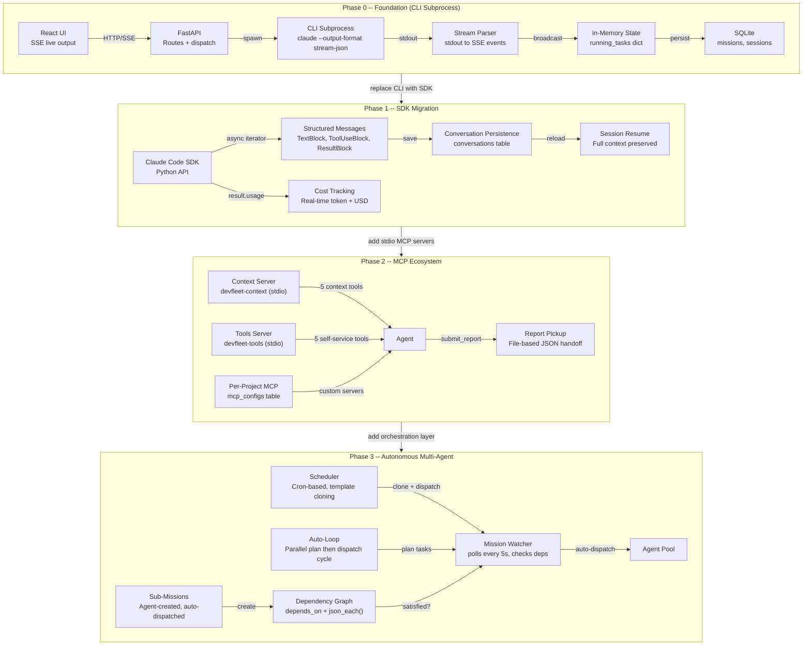
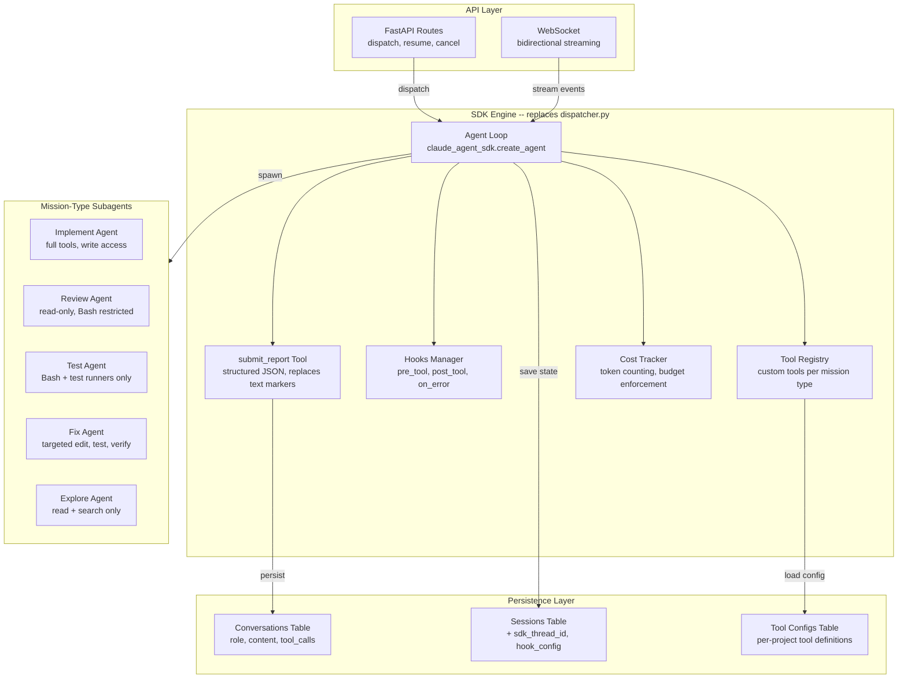
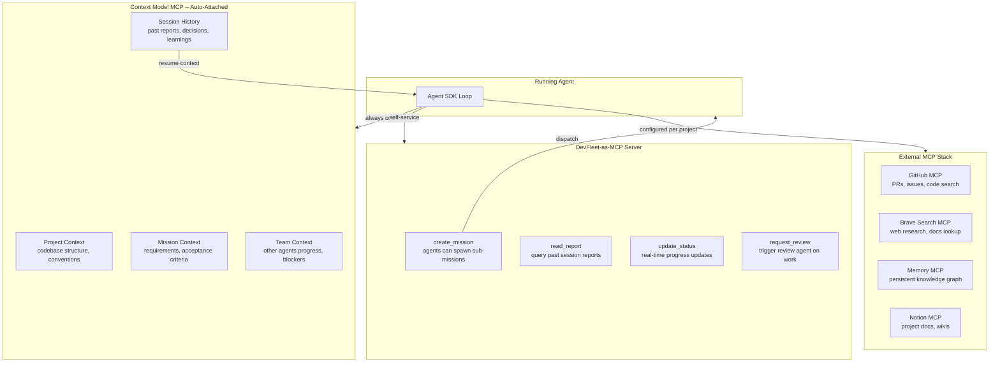
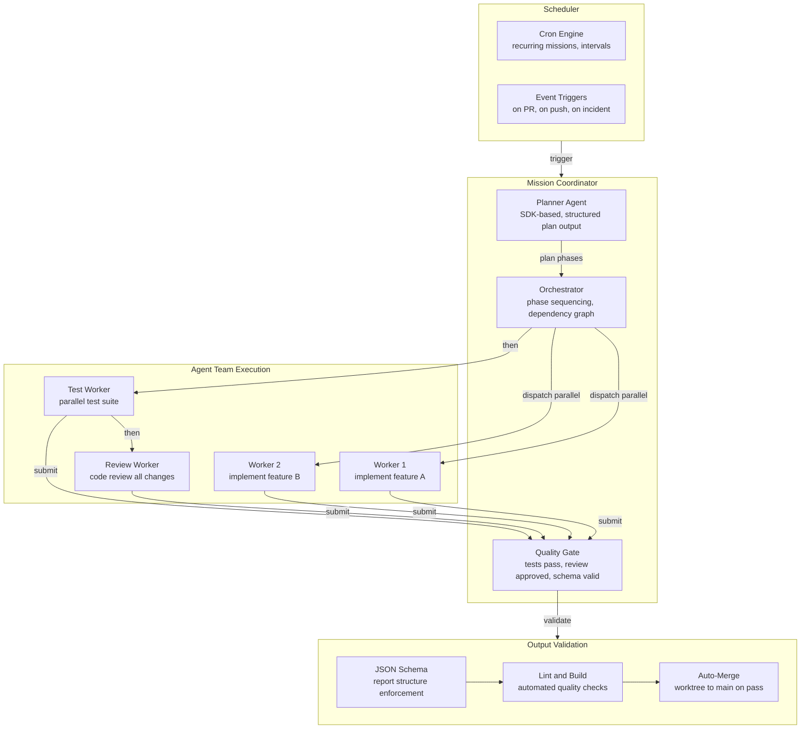

# DevFleet Architecture Diagrams

Visual documentation of the DevFleet platform architecture and its evolution from CLI subprocess spawning to an autonomous multi-agent platform.

> **Tip:** Open the `.html` files locally in a browser for styled, interactive versions of these diagrams.

---

## Architecture Evolution

From CLI subprocess to autonomous multi-agent platform across 4 phases.

---

## Current State to Target Architecture

High-level overview of the evolution plan.

```mermaid
graph TD
    subgraph Current["Current -- CLI Subprocess Model"]
        C_UI["React UI\nSSE streaming, dispatch panel"]
        C_API["FastAPI\napp.py, routes, in-memory state"]
        C_DISP["Dispatcher\nsubprocess.spawn, stream-json parse"]
        C_CLI["Claude CLI\n--output-format stream-json"]
        C_WT["Worktree\ngit isolation per agent"]
        C_DB["SQLite\nmissions, sessions, reports"]
        C_AL["Auto-Loop\nplan then dispatch then repeat"]
    end

    subgraph Phase1["Phase 1 -- Agent SDK Core"]
        P1_SDK["Agent SDK Engine\nPython API, native streaming"]
        P1_CONV["Conversation Store\nmessage history, resume state"]
        P1_STRUCT["Structured Output\ntool-based reports, JSON schema"]
        P1_HOOKS["Hooks System\npre/post tool, safety gates"]
        P1_SUB["Custom Subagents\nimplement, review, test, fix"]
    end

    subgraph Phase2["Phase 2 -- MCP Ecosystem"]
        P2_CTX["Context Model MCP\ndefault server for all agents"]
        P2_SELF["DevFleet-as-MCP\nexpose missions, reports, status"]
        P2_STACK["MCP Tool Stack\nGitHub, Brave, Notion, Memory"]
        P2_RESUME["Session Continuity\nMCP-backed resume with context"]
    end

    subgraph Phase3["Phase 3 -- Autonomous Platform"]
        P3_TEAMS["Agent Teams\nparallel workers, coordinator"]
        P3_SCHED["Scheduled Agents\ncron, recurring missions"]
        P3_MULTI["Multi-Phase Missions\nplan then implement then review then test"]
        P3_VALID["Output Validation\nschema enforce, quality gates"]
    end

    Current -->|"migrate"| Phase1
    Phase1 -->|"extend"| Phase2
    Phase2 -->|"orchestrate"| Phase3
```

---

## Phase 1 -- SDK Engine Detail

API layer, SDK engine internals, persistence, and mission-type subagents.

---

## Phase 2 -- MCP Ecosystem Detail

Context server, DevFleet-as-MCP, and external MCP integrations.

---

## Phase 3 -- Autonomous Multi-Agent Detail

Scheduler, mission coordination, parallel agent teams, and output validation.

---

## Files

| File | Description |
|------|-------------|
| [`devfleet-architecture-evolution.html`](devfleet-architecture-evolution.html) | Styled single-page architecture evolution diagram (open in browser) |
| [`devfleet-evolution-plan.html`](devfleet-evolution-plan.html) | Multi-section roadmap with 4 detailed phase diagrams (open in browser) |
