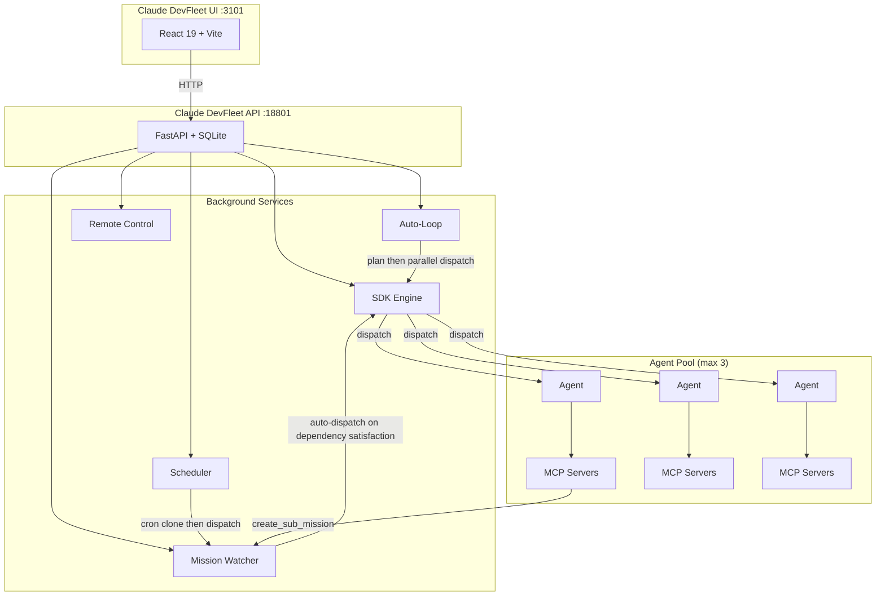
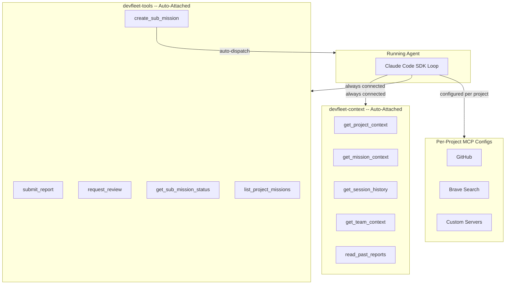
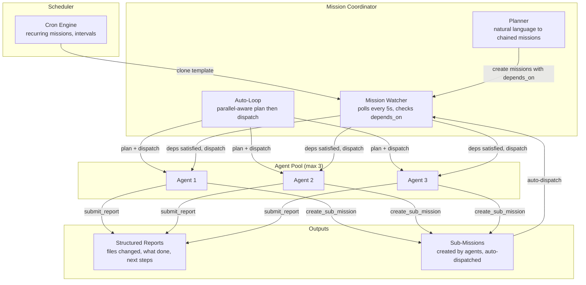
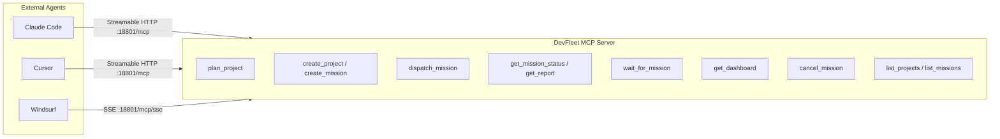

# DevFleet Architecture Diagrams

Visual documentation of the DevFleet platform architecture.

> **Tip:** Open the `.html` files locally in a browser for styled, interactive versions of these diagrams.

---

## System Overview

---

## MCP Ecosystem

Two stdio MCP servers auto-attached to every agent, plus per-project external servers.

---

## Multi-Agent Orchestration

Mission dependencies, scheduling, and autonomous dispatch flow.

---

## DevFleet-as-MCP Server

External agents (Claude Code, Cursor, Windsurf) integrate via Streamable HTTP or SSE.

---

## Files

| File | Description |
|------|-------------|
| [`devfleet-architecture-evolution.html`](devfleet-architecture-evolution.html) | Architecture evolution diagram across 4 phases (open in browser) |
| [`devfleet-evolution-plan.html`](devfleet-evolution-plan.html) | Detailed roadmap with phase breakdowns (open in browser) |
