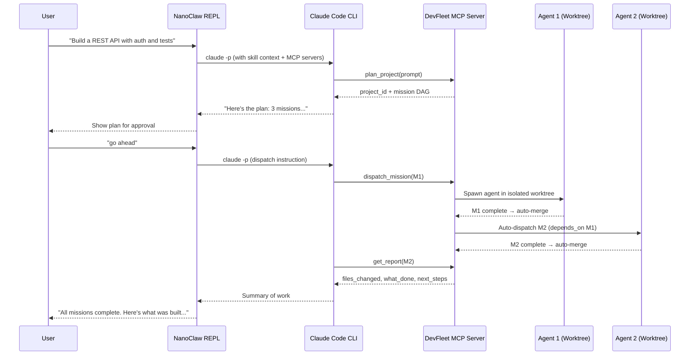

# Claude DevFleet + OpenClaw / NanoClaw Integration

Use Claude DevFleet as a multi-agent coding backend from OpenClaw or NanoClaw. Describe what you want to build, DevFleet plans the project, dispatches parallel Claude Code agents, and reports back — all from your REPL session.

## How It Works



## Setup

### 1. Start Claude DevFleet

```bash
git clone https://github.com/LEC-AI/claude-devfleet.git
cd claude-devfleet
./start.sh
# API running at http://localhost:18801
```

### 2. Register the MCP Server

NanoClaw uses the Claude CLI under the hood, which picks up MCP servers from your settings. Add DevFleet:

**Option A — Claude CLI (recommended):**
```bash
claude mcp add devfleet --transport http http://localhost:18801/mcp
```

**Option B — Manual config** (`~/.claude/settings.json`):
```json
{
  "mcpServers": {
    "devfleet": {
      "type": "http",
      "url": "http://localhost:18801/mcp"
    }
  }
}
```

### 3. Install the DevFleet Skill

Copy the skill to ECC's skills directory so NanoClaw can load it:

```bash
# If running from the ECC repo:
cp integrations/openclaw/devfleet-skill.md skills/claude-devfleet/SKILL.md

# Or from the DevFleet repo into your ECC install:
mkdir -p /path/to/everything-claude-code/skills/claude-devfleet
cp integrations/openclaw/devfleet-skill.md /path/to/everything-claude-code/skills/claude-devfleet/SKILL.md
```

### 4. Use It

```bash
# Start NanoClaw with the DevFleet skill pre-loaded:
CLAW_SKILLS=claude-devfleet node scripts/claw.js

# Or load it dynamically in the REPL:
/load claude-devfleet
```

## Triggering DevFleet from OpenClaw

### One-Shot: Plan and Launch

```
> Use DevFleet to build a Python CLI tool that converts CSV to JSON.
  Plan it, dispatch the first mission, and let me know when it's done.
```

What happens:
1. Claude calls `mcp__devfleet__plan_project(prompt="...")` → gets project + mission DAG
2. Shows you the plan with mission titles and dependencies
3. Calls `mcp__devfleet__dispatch_mission(mission_id=M1)` → first agent starts
4. Remaining missions auto-dispatch as dependencies resolve
5. Calls `mcp__devfleet__get_report(mission_id=...)` → reports results

### Check Status

```
> What's happening on DevFleet? Show me the dashboard.
```

Claude calls `mcp__devfleet__get_dashboard()` → shows running agents, slot usage, recent completions.

### Add to Existing Project

```
> Add a test suite mission to the calculator project on DevFleet,
  depending on the main implementation mission.
```

Claude calls `mcp__devfleet__create_mission(...)` with `depends_on` and `auto_dispatch=true`.

### Wait for Results

```
> Wait for mission M2 to finish and show me the report.
```

Claude calls `mcp__devfleet__wait_for_mission(mission_id="...", timeout_seconds=600)` → blocks until done, then `mcp__devfleet__get_report(...)`.

### Cancel a Runaway Agent

```
> Cancel the running mission on DevFleet.
```

Claude calls `mcp__devfleet__cancel_mission(mission_id="...")` → stops the agent immediately.

## Available MCP Tools

| Tool | Description |
|------|-------------|
| `plan_project(prompt)` | AI breaks description into chained missions with dependencies |
| `create_project(name, path?, description?)` | Create a project manually |
| `create_mission(project_id, title, prompt, ...)` | Add a mission with `depends_on`, `auto_dispatch`, `priority` |
| `dispatch_mission(mission_id, model?, max_turns?)` | Start an agent on a mission |
| `cancel_mission(mission_id)` | Stop a running agent |
| `wait_for_mission(mission_id, timeout_seconds?)` | Block until done (max 1800s) |
| `get_mission_status(mission_id)` | Check mission progress |
| `get_report(mission_id)` | Structured report: files_changed, what_done, what_tested, errors, next_steps |
| `get_dashboard()` | System overview: running agents, stats, recent activity |
| `list_projects()` | Browse all projects |
| `list_missions(project_id, status?)` | List missions, filter by status |

## Environment Variables

| Variable | Default | Description |
|----------|---------|-------------|
| `CLAW_SKILLS` | *(empty)* | Set to `claude-devfleet` to auto-load the skill |
| `CLAW_MODEL` | `sonnet` | Model for NanoClaw sessions |

## Architecture

```
┌─────────────────────────────────────────────┐
│  NanoClaw REPL                              │
│  /load claude-devfleet                      │
│                                             │
│  User: "Build me a REST API with tests"     │
│                                             │
│  ┌─────────────────────────────────────┐    │
│  │  claude -p (with DevFleet skill)    │    │
│  │                                     │    │
│  │  MCP tools available:               │    │
│  │  mcp__devfleet__plan_project        │    │
│  │  mcp__devfleet__dispatch_mission    │    │
│  │  mcp__devfleet__get_report          │    │
│  │  ... (11 tools total)               │    │
│  └──────────────┬──────────────────────┘    │
│                 │ MCP over HTTP               │
└─────────────────┼───────────────────────────┘
                  │
                  ▼
┌─────────────────────────────────────────────┐
│  Claude DevFleet API (:18801)               │
│                                             │
│  /mcp ← Streamable HTTP transport           │
│  /mcp/messages/ ← JSON-RPC handler         │
│                                             │
│  ┌──────────┐  ┌──────────┐  ┌──────────┐  │
│  │ Agent 1  │  │ Agent 2  │  │ Agent 3  │  │
│  │ worktree │  │ worktree │  │ worktree │  │
│  └──────────┘  └──────────┘  └──────────┘  │
│                                             │
│  Mission Watcher: auto-dispatch on deps met │
│  Planner: natural language → mission DAG    │
│  Reports: structured JSON per mission       │
└─────────────────────────────────────────────┘
```

## Notes

- DevFleet runs agents locally using Claude Code SDK — you need a valid Anthropic API key
- Each agent runs in an isolated git worktree and auto-merges on completion
- Missions can have dependencies — the mission watcher auto-dispatches when deps are met
- Max 3 concurrent agents by default (configurable via `DEVFLEET_MAX_AGENTS`)
- The DevFleet skill teaches Claude the right tool-calling patterns — without it, Claude can still use the MCP tools but may not follow the optimal workflow
